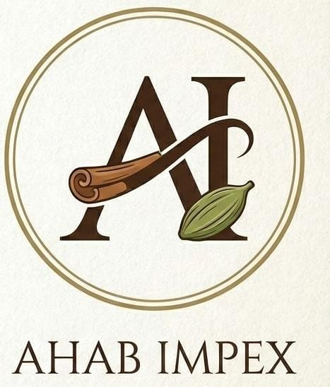

# AHAB IMPEX LLP - Premium Spice Export Website



## About

AHAB IMPEX LLP is a premium spice export company specializing in high-quality, handpicked spices including cardamom, cinnamon, cloves, and more. Our website showcases our product range and provides an easy way for B2B clients to connect with us.

## Features

- **Modern, Responsive Design**: Beautiful UI with AHAB IMPEX brand colors (browns, golds, and greens)
- **Product Catalog**: Comprehensive listing of premium spices
- **Contact Forms**: Easy inquiry and registration system
- **WhatsApp Integration**: Direct communication channel
- **Mobile-Friendly**: Fully responsive across all devices
- **SEO Optimized**: Proper meta tags and semantic HTML

## Technology Stack

- **Backend**: Django 5.x (Python)
- **Frontend**: Bootstrap 5.3, Custom CSS
- **Database**: SQLite (development) / PostgreSQL (production ready)
- **Animations**: AOS (Animate On Scroll)

## Installation & Setup

### Prerequisites
- Python 3.8 or higher
- pip (Python package manager)

### Local Development

1. **Clone the repository**
   ```bash
   cd h:/CascadeProjects/spice_website
   ```

2. **Create and activate virtual environment**
   ```bash
   python -m venv .venv
   .venv\Scripts\activate  # Windows
   ```

3. **Install dependencies**
   ```bash
   pip install -r requirements.txt
   ```

4. **Run migrations**
   ```bash
   python manage.py migrate
   ```

5. **Create superuser (optional)**
   ```bash
   python manage.py createsuperuser
   ```

6. **Run development server**
   ```bash
   python manage.py runserver
   ```

7. **Access the website**
   Open your browser and navigate to: `http://127.0.0.1:8000`

## Deployment

### Production Checklist

1. **Update settings.py**
   - Set `DEBUG = False`
   - Configure `ALLOWED_HOSTS`
   - Set up proper `SECRET_KEY`
   - Configure database (PostgreSQL recommended)

2. **Collect static files**
   ```bash
   python manage.py collectstatic
   ```

3. **Set up environment variables**
   Create a `.env` file with:
   ```
   SECRET_KEY=your-secret-key
   DEBUG=False
   DATABASE_URL=your-database-url
   ```

4. **Deploy to hosting platform**
   - Recommended: Heroku, PythonAnywhere, DigitalOcean, AWS
   - Configure WSGI server (Gunicorn recommended)
   - Set up reverse proxy (Nginx recommended)

### Quick Deploy to Heroku

```bash
# Install Heroku CLI and login
heroku login

# Create new Heroku app
heroku create ahab-impex-spices

# Add PostgreSQL
heroku addons:create heroku-postgresql:mini

# Deploy
git push heroku main

# Run migrations
heroku run python manage.py migrate

# Open the app
heroku open
```

## Configuration

### Branding Configuration

Update `config.json` to customize company information:

```json
{
  "company_name": "AHAB IMPEX LLP",
  "email": "info@ahabimpex.com",
  "phone": "+91 99259 88668"
}
```

### WhatsApp Integration

Update the phone number in `templates/base.html` (line 108):
```html
<a href="https://wa.me/919925988668?text=Hello%20AHAB%20IMPEX%20LLP" ...>
```

## Project Structure

```
spice_website/
├── manage.py
├── config.json
├── db.sqlite3
├── spice_site/          # Main Django project
│   ├── settings.py
│   ├── urls.py
│   └── wsgi.py
├── pages/               # Main app
│   ├── models.py
│   ├── views.py
│   └── urls.py
├── static/              # Static files
│   ├── css/
│   ├── js/
│   └── images/
└── templates/           # HTML templates
    ├── base.html
    └── pages/
```

## Customization

### Colors

The website uses AHAB IMPEX brand colors defined in `static/css/styles.css`:

```css
--spice-forest: #3a2716;    /* deep brown */
--spice-green: #4a5d3f;     /* olive green */
--spice-gold: #c8a165;      /* warm golden */
--spice-cream: #faf8f5;     /* soft cream */
```

### Adding Products

1. Access Django admin: `http://your-domain/admin`
2. Login with superuser credentials
3. Navigate to Products section
4. Add new products with images and descriptions

## Support

For technical support or inquiries:
- Email: info@ahabimpex.com
- Phone: +91 99259 88668
- WhatsApp: [Click to chat](https://wa.me/919925988668)

## License

© 2026 AHAB IMPEX LLP. All rights reserved.

---

**Built with ❤️ for premium spice exports**
